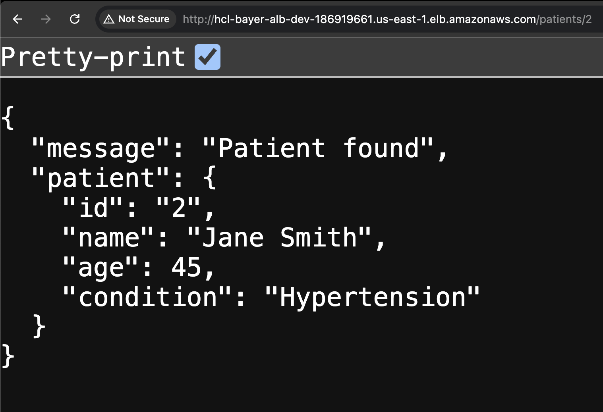
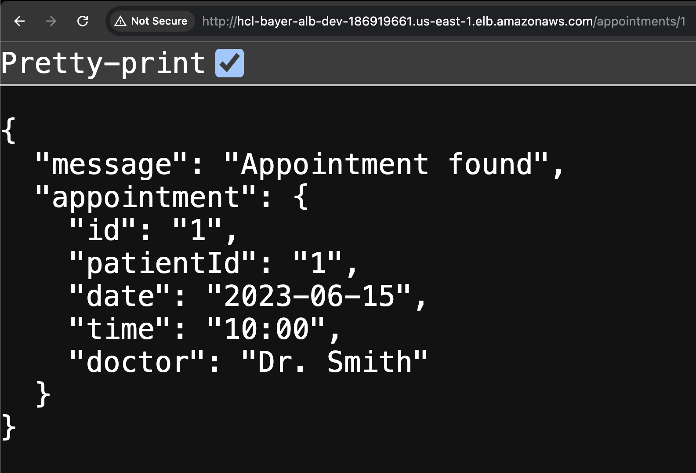

# DevOps Hackathon Challenge: Containerized Microservices Deployment 🚀

👋 **Hi there!** Thanks for checking out my project for the DevOps Hackathon Challenge. I built this to show off my skills. Let’s get started!

## Project Requirements and Instructions 📋

Want the full details? Check these out:

- [Main Challenge Page](https://hackathon.baywsf.com/devops/index.html)
- [Fargate Track Details](https://hackathon.baywsf.com/devops/fargate-track.html)

## Architecture Diagram 🏗️

  
_(Note: Add your architecture diagram here to see how everything connects!)_

## Project Overview 🌟

Here’s what I did:

- **Containerized** two microservices (Patient Service & Appointment Service) with Docker 🐳
- **Deployed** them on AWS Fargate 🚀
- Used **Terraform** for Infrastructure as Code (IaC) 🛠️
- Set up **CI/CD** with GitHub Actions 🤖
- Monitored everything with AWS CloudWatch 📊

## Project Folder Structure 📁

This is how my project is organized:

```
- .github/
  - workflows/
    - terraform-fmt-validate-plan.yml
    - terraform-apply.yml
    - build-docker-images.yml
    - deploy-to-ecs.yml
    - terraform-destroy.yml
- .gitignore/
- src/
  - patient-service/
    - patient-service.js
    - package.json
    - Dockerfile
  - appointment-service/
    - appointment-service.js
    - package.json
    - Dockerfile
- terraform/
  - main.tf
  - variables.tf
  - outputs.tf
  - providers.tf
  - modules/
    - vpc/
    - alb/
    - ecr/
    - iam/
    - ecs_cluster/
    - ecs_service/
  - environments/
    - dev/
      - dev.tfvars
      - backend.tf
- README.md
```

## How to Run the Project 🛠️

### Prerequisites

- **AWS Account**: Set up an IAM user with limited permissions for S3, ALB, ECR, ECS, VPC, Security Groups, and CloudWatch.
- **Access Keys**: Generate AWS access keys for the IAM user to use in GitHub Actions.
- **GitHub Account**: You’ll need this to fork the project.

### Setup

1. **Fork the Repo**: Go to my GitHub repo and click "Fork".
2. **Add Secrets**: In your forked repo, go to **Settings > Secrets and variables > Actions** and add:
   - `AWS_ACCESS_KEY_ID`: Your AWS access key ID.
   - `AWS_SECRET_ACCESS_KEY`: Your AWS secret access key.
   - `ECR_REGISTRY`: Your AWS ecr URL (e.g., `aws_account_id.dkr.ecr.region.amazonaws.com`).
3. **Terraform Backend**: Update `terraform/environments/dev/backend.tf` with your S3 bucket (e.g., `project-bucket-tf-state`) and DynamoDB table (e.g., `project-dynamodb-tf-lock`) for state management.
4. **Run It**: Push changes to your repo—GitHub Actions will handle the CI/CD magic!

## Final Results 🎉

It works! Here’s proof with load balancer DNS responses:  
  
  
_(Note: Add your screenshots here to show the services in action!)_

---

Thanks for stopping by! Hope you like it! 😊
